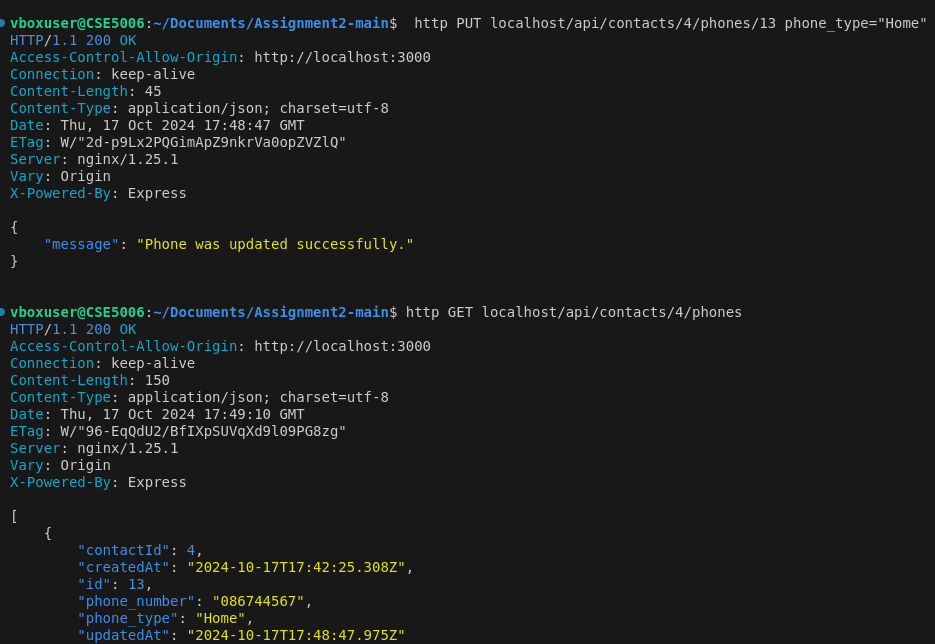
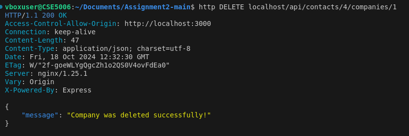

# README.md

IMPORTANT: Once you've cloned this to your forked repository, ensure that you continuously update this document as you complete each task to demonstrate your ongoing progress.

Please include your shared repository link here:

https://github.com/khanh-le3/A2-Khanh-21942752


Make sure for **your case it is in Private**
## Access Database
1 **Plsql Cheat Sheet:**
You can refer to the PostgreSQL cheat sheet [here](https://www.postgresqltutorial.com/postgresql-cheat-sheet/).gcdh

2 **Know the Container ID:**
To find out the container ID, execute the following command:
   ```bash
   docker ps
    9958a3a534c9   testsystem-nginx           "/docker-entrypoint.…"   6 minutes ago   Up 6 minutes   0.0.0.0:80->80/tcp   testsystem-nginx-1
    53121618baa4   testsystem-frontend        "docker-entrypoint.s…"   6 minutes ago   Up 6 minutes   3000/tcp             testsystem-frontend-1
    c89e46ac94b0   testsystem-api             "docker-entrypoint.s…"   6 minutes ago   Up 6 minutes   5000/tcp             testsystem-api-1
    9f4aea7cf538   postgres:15.3-alpine3.18   "docker-entrypoint.s…"   6 minutes ago   Up 6 minutes   5432/tcp             testsystem-db-1
   ```
3. Running the application

**docker compose command:**
   ```bash
   docker compose up --build
   ```

4 **Access postgreSQL in the container:**
Once you have the container ID, you can execute the container using the following command:
You will see the example of running the PostgreSQL inside the container.
   ```bash
   docker exec -it testsystem-db-1 psql -U postgres 
   choiruzain@MacMarichoy TestSystem % docker exec -it testsystem-db-1 psql -U postgres                                       
   psql (15.3)
   Type "help" for help.
   
   postgres=# \dt
             List of relations
    Schema |   Name   | Type  |  Owner   
   --------+----------+-------+----------
    public | contacts | table | postgres
    public | phones   | table | postgres
   (2 rows)
  
    postgres=# select * from contacts;
    id |  name  |         createdAt         |         updatedAt         
   ----+--------+---------------------------+---------------------------
     1 | Helmut | 2024-08-08 11:57:57.88+00 | 2024-08-08 11:57:57.88+00
    (1 row)
    postgres=# select * from phones;
    id | phone_type |   number    | contactId |         createdAt          |         updatedAt          
   ----+------------+-------------+-----------+----------------------------+----------------------------
     1 | Work       | 081431      |         1 | 2024-08-08 11:59:04.386+00 | 2024-08-08 11:59:04.386+00


postgres=# select * from contacts;
   ```
Replace `container_ID` with the actual ID of the container you want to execute.

## Executing API

### Contact API 


1. Add contacts API  (POST)
```bash
http post http://localhost/api/contacts name="Choiru"
        
choiruzain@MacMarichoy-7 TestSystem % http post http://localhost/api/contacts name="Choiru"
HTTP/1.1 200 OK
Access-Control-Allow-Origin: http://localhost:3000
Connection: keep-alive
Content-Length: 102
Content-Type: application/json; charset=utf-8
Date: Thu, 08 Aug 2024 21:01:53 GMT
ETag: W/"66-FmPYAaIkyQoroDwP2JsAZjWTAxs"
Server: nginx/1.25.1
Vary: Origin
X-Powered-By: Express

{
"createdAt": "2024-08-08T21:01:53.017Z",
"id": 1,
"name": "Choiru",
"updatedAt": "2024-08-08T21:01:53.017Z"
}

```
2 Get contacts API  (GET)

```bash
http get http://localhost/api/contacts


choiruzain@MacMarichoy-7 TestSystem % http get http://localhost/api/contacts
HTTP/1.1 200 OK
Access-Control-Allow-Origin: http://localhost:3000
Connection: keep-alive
Content-Length: 104
Content-Type: application/json; charset=utf-8
Date: Thu, 08 Aug 2024 21:04:58 GMT
ETag: W/"68-V+4KuL2xahYt8YAkKG6rKdR7wHg"
Server: nginx/1.25.1
Vary: Origin
X-Powered-By: Express

[
{
"createdAt": "2024-08-08T21:01:53.017Z",
"id": 1,
"name": "Choiru",
"updatedAt": "2024-08-08T21:01:53.017Z"
}
]


```
3. Show/create the API commmand to delete the contacts (DELETE)

```bash


```

4. Show/create the API command to edit the contacts (PUT)
```
http get http://localhost/api/contacts/1/phones

```

### Phone API


# Task 1
### 1.1 Change Delete button label to Delete Contact line 40 in Contact.js

### 1.2 Change Add contact button label to Add {contact.name}'s Phone in line 41 in NewPhone.js
### 1.3 Change text drop down list in line 33 in NewPhone.js

### 1.4 Change label Name to phone type in line 14 in PhoneList.js


### Interface result


# Task 2
### 2.1.Show the API command for “Show Contact” and provide a screenshot of the output 

### 2.2. Show the API command for “Add Contact” and provide a screenshot of the output 

### 2.3. Show the API command for “Delete Contact” and provide a screenshot of the output 

### 2.4. Show the API command for “Update Contact” and provide a screenshot of the output 

### 2.5. Show the API command for “Show Phone” and provide a screenshot of the output 

### 2.6. Show the API command for “Add Phone” and provide a screenshot of the output 

### 2.7. Show the API command for “Delete Phone” and provide a screenshot of the output 

### 2.8. Show the API command for “Update Phone” and provide a screenshot of the output 


# Task 3
## 3.1 

### Add the address attribute in the model in line 11 contact.model.js 

### Change the sync method to the following in  line 11 api/app.js  

### Add the address in 10 contact.controller.js


## 3.2 

### Add phone_type and phone_number line 8 phone.model.js 

### Add phone_type and phone_number line 8 phone.controller.js


## 3.3
### include input address line 31 in newContact.js

### include address display line 48 contact.js

### display titles phonetype, phonenumber, delete contact line 14 in PhoneList.js

### display phone_type, phone number, and delete button line 17 in phone.js


### Interface result


## 3.4
### Show Contact

### Add Contact

### Delete Contact 

### Update Contact and show by ID

### Show Phone

### Add Phone

### Delete Phone

### Update Phone and show by ID



# Task 4
## 4.1 
### Create Company.model.js
This file sets up the structure for the Company table in the database
``` 

module.exports = (sequelize, Sequelize) => {
    const Company = sequelize.define("company", {
        company_id: {
            type: Sequelize.INTEGER,
            autoIncrement: true,
            primaryKey: true,
        },
        company_name: {
            type: Sequelize.STRING,
        },
        company_address: {
            type: Sequelize.STRING,
        },
        contactId: {
            type: Sequelize.INTEGER,
            references: {
                model: 'contacts', 
                key: 'id', 
            }
        }
    });
    return Company;
};

``` 

### Create Company.controller.js
This file support the functions of creating, updating, deleting, retrieving all and a single company record 
``` 

const db = require("../models");
const Companies = db.companies;
const Op = db.Sequelize.Op;

//create company
exports.create = (req, res) => {
    const company = {
        company_name: req.body.company_name,
        company_address: req.body.company_address,
        contactId: parseInt(req.params.contactId)
    };

    Companies.create(company)
        .then(data => {
            res.send(data);
        })
        .catch(err => {
            res.status(500).send({
                message: 
                err.message || "Some error occurred"
            });
        });
};

// Retrieve all Companies
exports.findAll = (req, res) => {
    Companies.findAll({
        where: {
            contactId: parseInt(req.params.contactId)
        }
    })
        .then(data => {
            res.send(data);
        }) 
        .catch(err => {
            res.status(500).send({
                message: err.message || "Some error occurred" 
            });
        });
};

// Find a single Company by ID
exports.findOne = (req, res) => {
    Companies.findOne({
        where: {
            contactId: req.params.contactId,
            company_id: req.params.companyId 
        }
    })
        .then(data => {
            res.send(data);
        })
        .catch(err => {
            res.status(500).send({
                message: err.message || "Some error occurred"
            });
        });
};


// Update a Company
exports.update = (req, res) => {
    Companies.update(req.body, {
        where: { 
            contactId: req.params.contactId,
            company_id: req.params.companyId           
        }
    })
        .then(num => {
            if (num == 1) {
                res.send({
                    message: "Company was updated successfully."
                });
            } else {
                res.send({
                    message: `Cannot update Company`
                });
            }
        })
        .catch(err => {
            res.status(500).send({
                message: "Error updating Company with id=" 
            });
        });
};

// Delete a Company
exports.delete = (req, res) => {
    Companies.destroy({
        where: { 
            contactId: req.params.contactId,
            company_id: req.params.companyId 
        }
    })
        .then(num => {
            if (num == 1) {
                res.send({
                    message: "Company was deleted successfully!"
                });
            } else {
                res.send({
                    message: `Cannot delete Company`
                });
            }
        })
        .catch(err => {
            res.status(500).send({ 
                message: "Could not delete Company with id=" 
            });
        });
};

``` 
### Create companies.routes.js
This file sets up the routing for handling HTTP requests by linking to controller functions
``` 

module.exports = app => {
    const companies = require("../controllers/company.controller.js");
  
    var router = require("express").Router();
  
    router.post("/contacts/:contactId/companies", companies.create);
  
    router.get("/contacts/:contactId/companies", companies.findAll);
  
    router.get("/contacts/:contactId/companies/:companyId", companies.findOne);
  
    router.put("/contacts/:contactId/companies/:companyId", companies.update);
  
    router.delete("/contacts/:contactId/companies/:companyId", companies.delete);
   
    app.use('/api', router);
}; 

``` 

### Add companies db table line 25 api/models/index.js

### Add companies route in line 31 api/app.js

### Include companies in contact deletion line 4 and 87 in contact.controller.js


# 4.2
### Add Company

### Show Company

### Delete Company 

### Update Company and get by ID


### Companies table


# Task 5
### Create Company.js
This file manages the display and editing, deleting functions of a company’s details by sending requests. It receive user input and synchronize with database 
``` 

import React, { useState } from 'react';

function Company(props) {
  const { contact, company, companies, setCompanies } = props;
  const [isEditing, setIsEditing] = useState(false);
  const [companyName, setCompanyName] = useState(company.company_name);
  const [companyAddress, setCompanyAddress] = useState(company.company_address);

  async function deleteCompany() {
    const response = await fetch('http://localhost/api/contacts/' + contact.id + '/companies/' + company.company_id, {
        method: 'DELETE',
    });

    let newCompanies = companies.filter((p) => {
        return p.company_id !== company.company_id;
    });
    setCompanies(newCompanies);
  }

  async function updateCompany(e) {
    e.preventDefault();
    try {
        // Send PUT request to update the company details
        const response = await fetch('http://localhost/api/contacts/' + contact.id + '/companies/' + company.company_id, {
            method: 'PUT',
            headers: {
                'Content-Type': 'application/json',
            },
            body: JSON.stringify({
                company_name: companyName,     // Send updated company name
                company_address: companyAddress, // Send updated company address
            }),
        });

        // Check if the update was successful
        if (response.ok) {
            const updatedCompany = await response.json(); 

            // Update the state with the updated company
            const updatedCompanies = companies.map((c) =>
                c.company_id === updatedCompany.company_id ? updatedCompany : c
            );
            setCompanies(updatedCompanies);
            setIsEditing(false); // Exit edit mode
        } else {
            console.error('Failed to update company');
        }
    } catch (error) {
        console.error('Error updating company:', error);
    }
  }

  return (
    <tr>
      {isEditing ? (
        <>
          <td>
            <input
              type="text"
              value={companyName}
              onChange={(e) => setCompanyName(e.target.value)}
            />
          </td>
          <td>
            <input
              type="text"
              value={companyAddress}
              onChange={(e) => setCompanyAddress(e.target.value)}
            />
          </td>
          <td style={{ width: '14px' }}>
            <button className="button green" onClick={updateCompany}>Save</button>
            <button className="button red" onClick={() => setIsEditing(false)}>Cancel</button>
          </td>
        </>
      ) : (
        <>
          <td>{company.company_name}</td>
          <td>{company.company_address}</td>
          <td style={{ width: '14px' }}>
            <button className="button green" onClick={() => setIsEditing(true)}>Edit</button>
            <button className="button red" onClick={deleteCompany}>Delete Company</button>
          </td>
        </>
      )}
    </tr>
  );
}

export default Company;

``` 

### Create newCompany.js
This file allows users to add a new company belongs to a contact. It includes a form for entering the company’s name and address and handles the submission to create the new company.
``` 
import { useState } from 'react';

function NewCompany(props) {
    const {contact, companies, setCompanies} = props;
    const [company_name, setCompanyName] = useState('');
    const [company_address, setCompanyAddress] = useState('');

    async function createCompany(e) {
        e.preventDefault();
        
        // Send POST request to create a new company
        const response = await fetch('http://localhost/api/contacts/' + contact.id + '/companies', {
            method: 'POST',
            headers: {
                'Content-Type': 'application/json'
            },
            body: JSON.stringify({
                company_address,// Send company address
                company_name // Send company name
            })
        });

        const data = await response.json();

        if (data.company_id) {
            setCompanies([...companies, data]); // Update with the new company
        }
        setCompanyName(''); // Set the company name input
        setCompanyAddress(''); // Set the company address input
    }

	return (
        <form onSubmit={createCompany} onClick={(e) => e.stopPropagation()} className='new-company'>
            <input
                type="text"
                placeholder="Company Name"
                value={company_name}
                onChange={(e) => setCompanyName(e.target.value)}  //Update company name 
            />
            <input
                type="text"
                placeholder="Company Address"
                value={company_address}
                onChange={(e) => setCompanyAddress(e.target.value)}   //Update company address
            />
            <button className='button green' type='submit'>Add Company</button>
        </form>
	);
}

export default NewCompany;
``` 


### Create CompanyList.js
This file manages the list of companies belongs to a contact and it support the functions to display, add, and modify company records.
``` 

import Company from './Company.js';
import NewCompany from './NewCompany.js';

function CompanyList(props) {
    const {contact, companies, setCompanies} = props;

	return (
        <div className='company-list'>
            <NewCompany companies={companies} setCompanies={setCompanies} contact={contact} />

            <table onClick={(e) => e.stopPropagation()}>
                <thead>
                    <tr>
                        <th>Company Name</th>
                        <th>Company Address</th>
                        <th>Modification</th>
                    </tr>
                </thead>
                <tbody>
                    {
                        companies.map((company) => {
                            return (
                                <Company key={company.company_id} company={company} companies={companies} setCompanies={setCompanies} contact={contact} />
                            );
                        })
                    }
                </tbody>
            </table>
        </div>
	);
}

export default CompanyList;

``` 

### Add CompanyList for displaying line 3,9,18,56 in contact.js 


### User Interface walk through


.png)

Updated company info after refresh


.png)


